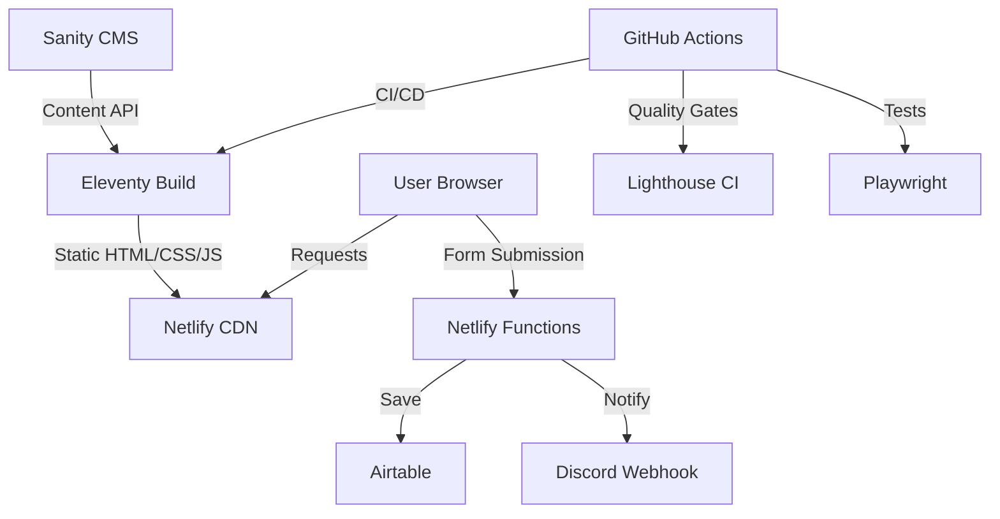
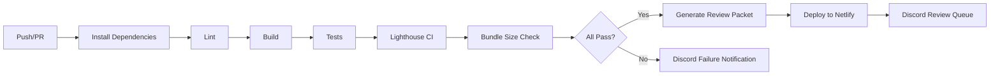

# Architecture Documentation

## Overview

MyWebClass Design Gallery is built with Eleventy (11ty), integrated with Sanity CMS, and deployed on Netlify. The architecture emphasizes automation, quality gates, and maintainability.

## System Architecture



## Data Flow

### Sanity → Eleventy → Netlify

1. **Content Creation**: Editors create content in Sanity CMS
2. **Build Time**: Eleventy fetches content from Sanity during build
3. **Static Generation**: Content is compiled into static HTML
4. **Deployment**: Netlify serves static files from CDN

### Form Submission Flow

1. **User Submission**: Form data submitted via JavaScript
2. **Netlify Function**: `_functions/submit.js` receives POST request
3. **Airtable**: Submission saved to Airtable CRM
4. **Discord**: Notification sent to Discord webhook
5. **Response**: Success/error response returned to user

## Theme System Architecture

### CSS Variables + Data Attributes

Themes are implemented using CSS custom properties (variables) and HTML data attributes:

```css
[data-theme="onyx"] {
  --color-bg-primary: #0a0a0a;
  --color-text-primary: #f5f5f5;
  /* ... */
}
```

### Theme Switcher

- JavaScript reads/writes to `localStorage`
- Updates `data-theme` attribute on `<html>` element
- CSS variables automatically apply based on attribute

### Theme Persistence

- User preference stored in `localStorage`
- Persists across page loads
- Default theme: `calm`

## CMS/Content Model Boundaries

### Sanity CMS Schema

```javascript
{
  name: 'page',
  type: 'document',
  fields: [
    { name: 'title', type: 'string' },
    { name: 'slug', type: 'slug' },
    { name: 'content', type: 'array', of: [{ type: 'block' }] }
  ]
}
```

### Content Boundaries

- **Static Content**: Theme pages, navigation (in Eleventy templates)
- **Dynamic Content**: CMS-driven pages (from Sanity)
- **User-Generated**: Form submissions (stored in Airtable)

## Submission Pipeline

### Form → Netlify Function → Airtable + Discord

1. **Client-Side Validation**: HTML5 + JavaScript validation
2. **Netlify Function**: Serverless function handles submission
3. **Airtable Integration**: Saves structured data to Airtable
4. **Discord Notification**: Sends formatted message to Discord channel
5. **Error Handling**: Graceful degradation if services unavailable

### Netlify Function Structure

```
_functions/
  ├── submit.js          # Form submission handler
  ├── sanity-content.js  # Sanity CMS fetcher
  └── discord-webhook.js # Discord utility module
```

## Consent + Analytics Gating Flow

### GDPR Compliance

1. **Cookie Banner**: Shown on first visit
2. **User Choice**: Accept or Reject analytics
3. **localStorage**: Consent stored with version
4. **Analytics Gate**: Analytics only load if consent given
5. **Privacy Policy**: Linked from banner and footer

### Analytics Implementation

```javascript
// Only loads if consent given
if (ConsentManager.hasConsent()) {
  initAnalytics();
}
```

## CI/CD Pipeline

### GitHub Actions Workflow



### Quality Gates

1. **Linting**: ESLint, Stylelint, Markdownlint
2. **Tests**: Playwright E2E tests
3. **Lighthouse CI**: Performance, Accessibility, Best Practices, SEO
4. **Bundle Size**: JavaScript and CSS size limits
5. **Build**: Eleventy build must succeed

### Review Packet Generation

- Generated only when all gates pass
- Includes metrics, scores, and recommendations
- Posted to Discord review queue
- Stored in `logs/review-packet.txt`

## File Structure

```
CMS Project/
├── src/                    # Source files
│   ├── _includes/         # Eleventy includes
│   │   ├── components/    # Reusable components
│   │   └── layouts/       # Page layouts
│   ├── themes/            # Theme detail pages
│   ├── css/               # Stylesheets
│   │   ├── themes.css     # Theme variables
│   │   └── base.css       # Base styles
│   └── js/                # JavaScript
│       ├── theme-switcher.js
│       ├── consent.js
│       └── analytics.js
├── _functions/            # Netlify Functions
├── tests/                 # Playwright tests
├── docs/                  # Documentation
├── logs/                  # Generated logs
└── .github/workflows/     # CI/CD config
```

## Technology Stack

- **Static Site Generator**: Eleventy 2.0
- **CMS**: Sanity
- **Hosting**: Netlify
- **CRM**: Airtable
- **Notifications**: Discord Webhooks
- **Testing**: Playwright
- **CI/CD**: GitHub Actions
- **Quality**: Lighthouse CI

## Environment Variables

See `.env.example` for required environment variables:

- Sanity credentials
- Airtable credentials
- Discord webhook URLs
- Analytics configuration

## Deployment

1. **Build**: `npm run build` generates `_site/`
2. **Deploy**: Netlify automatically deploys on push to main
3. **Functions**: Netlify Functions deployed automatically
4. **CDN**: Static assets served from Netlify CDN

## Performance Considerations

- Static site generation for fast load times
- Minimal JavaScript (theme switcher, consent, analytics only)
- CSS variables for efficient theme switching
- Netlify CDN for global distribution
- Lighthouse CI enforces performance thresholds

